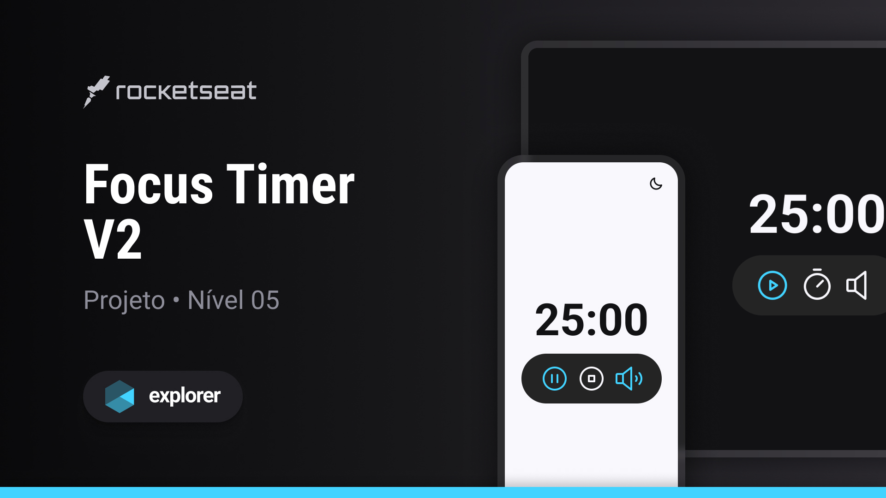

<h1 align="center"> Calculadora de IMC </h1>

Programa promovido no nível 5 da trilha Explorer da Rocketseat para ensino de tecnologias WEB. 

- [Acesse o projeto finalizado, online](https://bernardosa01.github.io/Focus-Timer/)
  

  <a href="#-tecnologias">Tecnologias</a>&nbsp;&nbsp;&nbsp;|&nbsp;&nbsp;&nbsp;
  <a href="#-projeto">Projeto</a>&nbsp;&nbsp;&nbsp;|&nbsp;&nbsp;&nbsp;
  <a href="#-layout">Layout</a>&nbsp;&nbsp;&nbsp;|&nbsp;&nbsp;&nbsp;
  <a href="#memo-licença">Licença</a>

  

 

  

Os botões abaixo do timer apresentam as seguintes funcionalidades: 

- Play / Pause: aciona / pausa o contador;
- Stop: Para o contador;
- Set (Cronômetro): Permite que o usuário digite o tempo que desejar no timer;
- Music on/off: Liga/Desliga uma música relaxante;
- Lua / Sol no canto superior direito da tela: Opção de ativar / desativar o modo escuro, trazendo uma opção de conforto a mais ao usuário;
  
- 
Além disso, o cronômetro emite um sinal sonoro ao zerar, informando ao usuário que o tempo esgotou.

## 🚀 Tecnologias

Esse projeto foi desenvolvido com as seguintes tecnologias:

- HTML
- CSS
- JavaScript
- Figma

## 💻 Projeto

- 
A aplicação consiste em um temporizador ao estilo Pomodoro, para auxílio ao usuário principalmente no foco ao estudar.    

- 
Nesta etapa pude reforçar meus conhecimentos em ES6 Modules, entendendo a importância da ferramenta para um código mais legível e organizado, e com maior facilidade de manutenção. Além de colocar em prática importantes conceitos de acessibilidade, deixando a aplicação totalmente acessível para leitores de tela.

## 🔖 Layout

Você pode visualizar o layout do projeto através [DESSE LINK](https://www.figma.com/community/file/1263574581735209131). É necessário ter conta no [Figma](https://figma.com) para acessá-lo.

## :memo: Licença

Esse projeto está sob a licença MIT.

---

Feito por Bernardo Sá :wave: [Participe da comunidade da Rocketseat!](https://discord.gg/rocketseat)